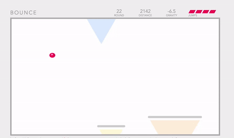

# Bounce

A platform hopping ball bouncing sort of game written in JavaScript.

---

## Gameplay

As the ball gains altitude, gravity decreases, platforms become smaller and more spread out, and jumps are replenished more slowly.

As time passes, the world moves faster, reaching the top becomes more difficult.

If the player doesn't get to the top fast enough, things get pretty chaotic:

## Live
[Play it here](https://smichaelrogers.github.io/bounce)

---

## License
MIT
